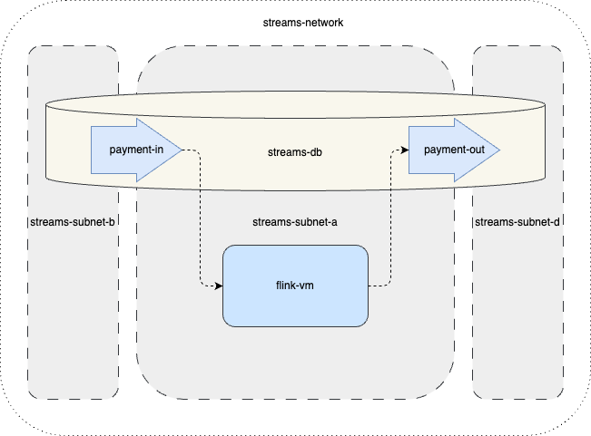
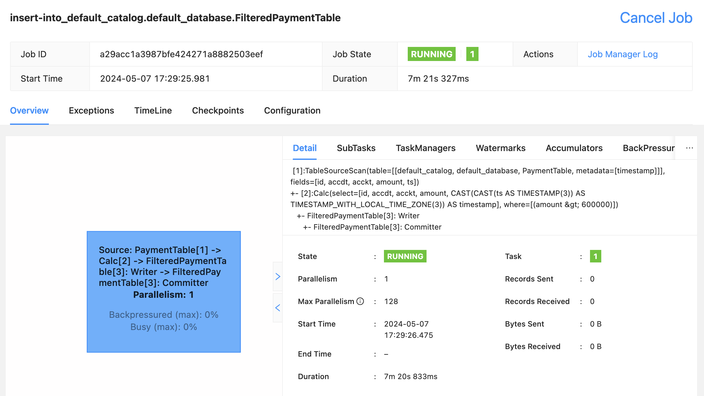

# Использование Apache Flink c топиками YDB

В этом решении показана возможность использования сервисов [Yandex Managed Service for YDB](https://yandex.cloud/ru/services/ydb) и [Yandex Data Streams](https://yandex.cloud/ru/services/data-streams), как замены Apache Kafka при работе с Flink SQL stream processing. В качестве задачи взят простейший пример фильтрации платежей с суммой более 600000.  

Для этого будут созданы

- Инфраструктура для примера: сеть, подсети, группы доступа и сервисный аккаунт. 
- Бессерверная СУБД [YDB](https://ydb.tech/ru) и два топика в ней.
- VM, на которой будет развернут [Apache Flink](https://flink.apache.org/).




В решении используется [Flink SQL](https://nightlies.apache.org/flink/flink-docs-release-1.19/docs/dev/table/sql/overview/), во многом совместимый со стандартом ANSI SQL. Это один из вариантов использования Apache Flink, в котором можно обойтись без создания процедур обработки данных, а только декларативно описать источник, приемник и правило обработки потока данных.

## Подготовка инфраструктуры

Для подготовки инфраструктуры используется Terraform configuration. При необходимости ознакомиться с работой [Terraform](https://www.terraform.io/) в Yandex Cloud можно [здесь](https://yandex.cloud/ru/docs/tutorials/infrastructure-management/terraform-quickstart)

Указать корректные настройки в terraform.tfvars для развертывания инфраструктуры с помощью Terraform 

Получить IAM токен 

```sh 
export TF_VAR_yc_token=$(yc iam create-token)
```

Инициализировать провайдеров для работы с конфигурацией
```sh 
cd tf
terraform init
```

Запустить процесс создания облачной инфраструктуры

```sh
terraform apply
```

Установить переменные среды для использования в kafkacat

```sh
export API_KEY=$(terraform output -raw api_key)  
export DATABASE_PATH=$(terraform output -raw database_path)
```

<sup>Здесь необходмо учесть, что после создания VM сloud-init agent ставит и конфигурирует Apache Flink. Это занимает некоторое время - до нескольких минут. К следующим шагам стоит переходить только после окончания процесса установки. Дождаться его можно, например, запустив следующий сценарий</sup>

```sh
until curl -s -f -o /dev/null "http://$(terraform output -raw instance_external_ip):8081"
do
  sleep 5
done
```
<sup>
Если не удается дождаться его окончания, то имеет смысл проверить логи cloud-init в /var/log/cloud-init-output.log
</sup>

## Создание задания обработки данных

На этом этапе можно зайти браузером в WebUI. В дальнейшем таким образом можно контролировать работу SQL Streaming job

`http://<instance_external_ip>:8081/#/overview`

Подключиться к VM через ssh

```sh
ssh ubuntu@$(terraform output -raw instance_external_ip)
```

Запустить Flink SQL client

```sh 
/opt/flink-1.19.0/bin/sql-client.sh
```


Создать Flink таблицы - здесь заменить плейсхолдеры <> на соответствующие значения, полученные из terraform output

``` sql
create table PaymentTable (  
    id INT,  
    accdt INT,  
    acckt INT,  
    amount FLOAT,  
    ts TIMESTAMP(3) METADATA FROM 'timestamp'  
) with (  
    'connector' = 'kafka',  
    'topic' = 'bank/payment-in',  
    'value.format' = 'json',  
    'key.format' = 'raw',  
    'key.fields' = 'id',  
    'properties.group.id' = 'test-group',  
    'scan.startup.mode' = 'earliest-offset',  
    'properties.bootstrap.servers' = 'ydb-01.serverless.yandexcloud.net:9093',  
    'properties.acks' = 'all',  
    'properties.check.crcs' = 'false',  
    'properties.security.protocol' = 'SASL_SSL',  
    'properties.sasl.mechanism' = 'PLAIN',  
    'properties.sasl.jaas.config' = 'org.apache.flink.kafka.shaded.org.apache.kafka.common.security.scram.ScramLoginModule required username="@<DATABASE_PATH>" password="<API_KEY>";'
);
```   

``` sql
create table FilteredPaymentTable (  
    id INT,  
    accdt INT,  
    acckt INT,  
    amount FLOAT,  
    ts TIMESTAMP(3) METADATA FROM 'timestamp'  
) with (  
    'connector' = 'kafka',  
    'topic' = 'bank/payment-out',  
    'value.format' = 'json',  
    'key.format' = 'json',  
    'key.fields' = 'id',  
    'properties.group.id' = 'test-group',  
    'scan.startup.mode' = 'earliest-offset',  
    'properties.bootstrap.servers' = 'ydb-01.serverless.yandexcloud.net:9093',  
    'properties.acks' = 'all',  
    'properties.security.protocol' = 'SASL_SSL',  
    'properties.sasl.mechanism' = 'PLAIN',  
    'properties.sasl.jaas.config' = 'org.apache.flink.kafka.shaded.org.apache.kafka.common.security.scram.ScramLoginModule required username="@<DATABASE_PATH>" password="<API_KEY>";'
);
```


Запустить SQL job фильтрации

``` sql
insert into FilteredPaymentTable select * from PaymentTable where amount > 600000;
```

## Проверка работоспособности

Сымитировать поступление данных  - добавить несколько записей в топик payment-in


``` sh 
echo '{"id":1,"accdt":1,"acckt":2,"amout":10.3}' | kcat -P \
    -b ydb-01.serverless.yandexcloud.net:9093 \
    -t bank/payment-in \
    -X security.protocol=SASL_SSL \
    -X sasl.mechanism=PLAIN \
    -X sasl.username="@$DATABASE_PATH" \
    -X sasl.password="$API_KEY"
```


``` sh
echo '{"id":3,"accdt":10,"acckt":11,"amount":600001.3}' | kcat -P \
    -b ydb-01.serverless.yandexcloud.net:9093 \
    -t bank/payment-in \
    -X security.protocol=SASL_SSL \
    -X sasl.mechanism=PLAIN \
    -X sasl.username="@$DATABASE_PATH" \
    -X sasl.password="$API_KEY"
```    

Проверить корректность работы решения. Для этого убедиться, что в исходящем топике payment-out появляются только записи с amount > 600000

``` sh
kafkacat -C \
    -b ydb-01.serverless.yandexcloud.net:9093 \
    -t bank/payment-out \
    -X security.protocol=SASL_SSL \
    -X sasl.mechanism=PLAIN \
    -X sasl.username="@$DATABASE_PATH" \
    -X sasl.password="$API_KEY"  -Z
```    

Примерный вид созданного задания в Web UI
