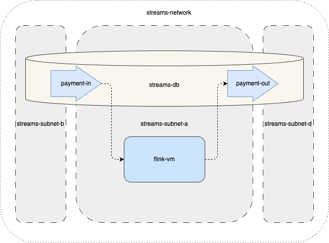
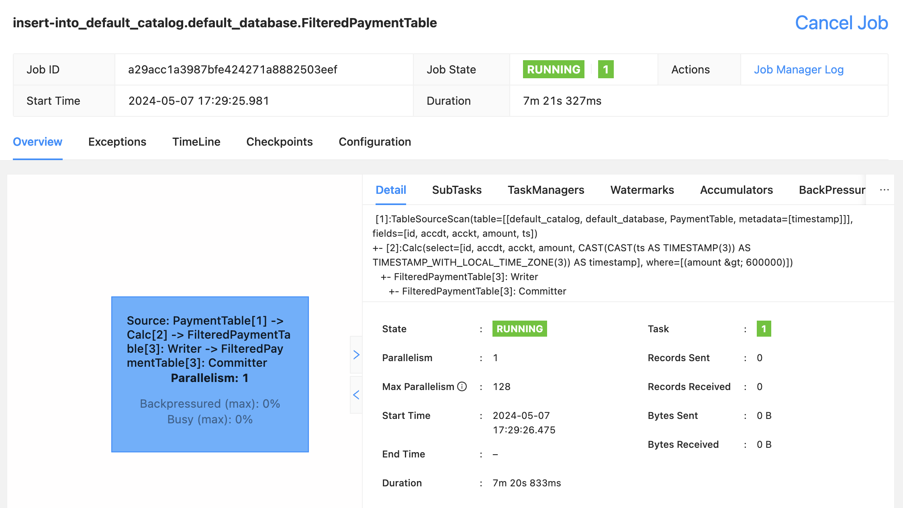

# Using Apache Flink with YDB topics

This guide shows you how to combine [Yandex Managed Service for YDB](https://yandex.cloud/en/services/ydb) and [Yandex Data Streams](https://yandex.cloud/en/services/data-streams) to replace Apache Kafka when woking with Flink SQL stream processing. As an example, let's filter payments over 600,000.

For this, we need to create:

- Sample infrastructure, consisting of a network, subnets, access groups, and a service account.
- Serverless [YDB](https://ydb.tech/ru) with two topics in it.
- VM to deploy your [Apache Flink](https://flink.apache.org/).




This use case employs [Flink SQL](https://nightlies.apache.org/flink/flink-docs-release-1.19/docs/dev/table/sql/overview/), largely compatible with the ANSI SQL standard. A way to use Apache Flink, this requires no data processing routines; all you need to do is declaratively describe the source, target, and processing rule for a data stream.

## Setting up the infrastructure

To set up the infrastructure, use a Terraform configuration. See [this guide](https://yandex.cloud/en/docs/tutorials/infrastructure-management/terraform-quickstart) to learn more about [Terraform](https://www.terraform.io/) in Yandex Cloud.

To deploy your infrastructure with Terraform, specify the correct settings in `terraform.tfvars`:

Get an IAM token:

```sh 
export TF_VAR_yc_token=$(yc iam create-token)
```

Initialize the providers for the configuration:
```sh 
cd tf
terraform init
```

Start creating your cloud infrastructure:

```sh
terraform apply
```

Install environment variables for your `kafkacat` to use:

```sh
export API_KEY=$(terraform output -raw api_key)  
export DATABASE_PATH=$(terraform output -raw database_path)
```

<sup>Keep in mind that, once your VM is created, `cloud-init agent` needs some time to install and configure Apache Flink. Usually, this takes a few minutes. Do not proceed any further until the installation is complete. To set up waiting for the completion, run a script like this:</sup>

```sh
until curl -s -f -o /dev/null "http://$(terraform output -raw instance_external_ip):8081"
do
  sleep 5
done
```
<sup>
If you are facing issues with waiting for it to finish, check the `cloud-init` logs in `/var/log/cloud-init-output.log`.
</sup>

## Creating a data processing job

Optionally, go to the WebUI in your browser. Moving forward, you will be able to monitor the SQL Streaming job in this way:

`http://<instance_external_ip>:8081/#/overview`

Connect to the VM over `ssh`:

```sh
ssh ubuntu@$(terraform output -raw instance_external_ip)
```

Run the Flink SQL client:

```sh 
/opt/flink-1.19.0/bin/sql-client.sh
```

Create Flink tables. Make sure to replace `<placeholders>` with the respective values from the Terraform output:

``` sql
create table PaymentTable (  
    id INT,  
    accdt INT,  
    acckt INT,  
    amount FLOAT,  
    ts TIMESTAMP(3) METADATA FROM 'timestamp'  
) with (  
    'connector' = 'kafka',  
    'topic' = 'bank/payment-in',  
    'value.format' = 'json',  
    'key.format' = 'raw',  
    'key.fields' = 'id',  
    'properties.group.id' = 'test-group',  
    'scan.startup.mode' = 'earliest-offset',  
    'properties.bootstrap.servers' = 'ydb-01.serverless.yandexcloud.net:9093',  
    'properties.acks' = 'all',  
    'properties.check.crcs' = 'false',  
    'properties.security.protocol' = 'SASL_SSL',  
    'properties.sasl.mechanism' = 'PLAIN',  
    'properties.sasl.jaas.config' = 'org.apache.flink.kafka.shaded.org.apache.kafka.common.security.scram.ScramLoginModule required username="@<DATABASE_PATH>" password="<API_KEY>";'
);
```   

``` sql
create table FilteredPaymentTable (  
    id INT,  
    accdt INT,  
    acckt INT,  
    amount FLOAT,  
    ts TIMESTAMP(3) METADATA FROM 'timestamp'  
) with (  
    'connector' = 'kafka',  
    'topic' = 'bank/payment-out',  
    'value.format' = 'json',  
    'key.format' = 'json',  
    'key.fields' = 'id',  
    'properties.group.id' = 'test-group',  
    'scan.startup.mode' = 'earliest-offset',  
    'properties.bootstrap.servers' = 'ydb-01.serverless.yandexcloud.net:9093',  
    'properties.acks' = 'all',  
    'properties.security.protocol' = 'SASL_SSL',  
    'properties.sasl.mechanism' = 'PLAIN',  
    'properties.sasl.jaas.config' = 'org.apache.flink.kafka.shaded.org.apache.kafka.common.security.scram.ScramLoginModule required username="@<DATABASE_PATH>" password="<API_KEY>";'
);
```


Run the SQL job to filter data:

``` sql
insert into FilteredPaymentTable select * from PaymentTable where amount > 600000;
```

## Health check

Populate the `payment-in` topic with a few entries to simulate new data:


```sh 
echo '{"id":1,"accdt":1,"acckt":2,"amout":10.3}' | kcat -P \
    -b ydb-01.serverless.yandexcloud.net:9093 \
    -t bank/payment-in \
    -X security.protocol=SASL_SSL \
    -X sasl.mechanism=PLAIN \
    -X sasl.username="@$DATABASE_PATH" \
    -X sasl.password="$API_KEY"
```


```sh
echo '{"id":3,"accdt":10,"acckt":11,"amount":600001.3}' | kcat -P \
    -b ydb-01.serverless.yandexcloud.net:9093 \
    -t bank/payment-in \
    -X security.protocol=SASL_SSL \
    -X sasl.mechanism=PLAIN \
    -X sasl.username="@$DATABASE_PATH" \
    -X sasl.password="$API_KEY"
```    

Now it is time to check that everything works fine. The `payment-out` outbound topic should only include entries with an `amount` of over 600,000:

```sh
kafkacat -C \
    -b ydb-01.serverless.yandexcloud.net:9093 \
    -t bank/payment-out \
    -X security.protocol=SASL_SSL \
    -X sasl.mechanism=PLAIN \
    -X sasl.username="@$DATABASE_PATH" \
    -X sasl.password="$API_KEY"  -Z
```    

Here is how the created job might look in the WebUI:


